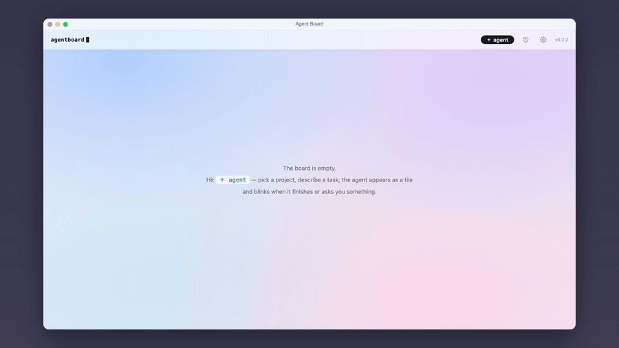

# Agent Board

**Spatial board for Claude Code, Codex, Cursor and opencode.** One card is one
conversation: start agents into any project folder, drag the cards wherever they
make sense, and see at a glance who is working, who finished, and who is waiting
for you.



**[Download AgentBoard.dmg](https://github.com/mikky-a/agentboard/releases/latest/download/AgentBoard.dmg)** ·
[agentboard site](https://mikky-a.github.io/agentboard/) · macOS 13+ · MIT

- **Start an agent in a second** — pick a folder, type the task. It runs in the
  background as a tile; no terminal window opens.
- **A card turns amber the moment an agent needs you** — the header counts how
  many are waiting, so you stop finding out forty minutes later.
- **Answer from the board** — reply straight from the card; open the live
  terminal only when you want to watch.
- **Nothing piles up** — cards survive reboots and resume with one click,
  removing a card never deletes history, and your desktop stays clean.
- **Three skins** — terminal phosphor, macOS glass, Soviet retro console, each
  with a night mode.

Everything runs locally: the board reads the CLIs' own logs and talks to tmux on
your machine. No account, no telemetry. The UI speaks English and Russian.

## Requirements

- macOS 13+ (Apple Silicon)
- Any of: [Claude Code](https://claude.com/claude-code), [Codex CLI](https://github.com/openai/codex),
  [Cursor CLI](https://cursor.com/docs/cli), [opencode](https://opencode.ai)

That's it — the app is self-contained (bundles its own Python runtime and tmux),
signed and notarized. No Homebrew, no Xcode tools.

## Quickstart

**[Download AgentBoard.dmg](https://github.com/mikky-a/agentboard/releases/latest/download/AgentBoard.dmg)**,
drag to Applications, open. The dock icon shows a badge with how many agents
are waiting for you.

<details>
<summary>Alternative: install from source (curl | sh)</summary>

```bash
curl -fsSL https://raw.githubusercontent.com/mikky-a/agentboard/main/install.sh | sh
```

This clones the repo into `~/.agentboard`, sets up start-on-login (launchd),
installs tmux if missing (via Homebrew), builds **AgentBoard.app** with your
Xcode Command Line Tools into `~/Applications` and opens it; without `swiftc`
it falls back to the browser at `http://localhost:8787`. Updates ride on
`git pull` — re-run the same command anytime.

</details>

Prefer to run things by hand?

```bash
git clone https://github.com/mikky-a/agentboard.git
cd agentboard
python3 agentboard.py        # server → http://localhost:8787
./build_app.sh               # native app (optional)
```

Open the board in a browser. If status hooks are not installed yet, a banner
appears in the top bar — click it once. It idempotently adds lifecycle hooks
for every CLI you have installed (backing up your originals as
`*.agentboard-bak`): `~/.claude/settings.json`, `~/.codex/hooks.json`,
`~/.cursor/hooks.json` (plus a `Shell(tee)` allowlist entry — Cursor's CLI
ignores hook permission responses), and an opencode plugin in
`~/.config/opencode/plugins/`. Restart any live agent sessions after
installing; Codex will ask to trust the new hooks — choose "Trust all and
continue". When you create an agent from the board, the folder is pre-trusted
in the CLI's own config (Claude / Codex / Cursor), so agents don't silently
stall on first-run "do you trust this directory?" dialogs.

## Statuses

🟢 working · 🟡 waiting for you (blinks + sound) · ⚪ idle · 🔵 paused

Statuses come from the CLIs' own lifecycle hooks (e.g. the `PermissionRequest`
event) writing to `~/.claude/agent-status/<tmux-session>` — no fragile parsing
of terminal output.

## Native app

`install.sh` builds it automatically; to rebuild by hand: `./build_app.sh`
(swiftc + icon → AgentBoard.app). The dock badge shows how many agents are
waiting for you — the board lives in the Dock, not in a browser tab.

## Updates

The board checks GitHub Releases once a day; when a new version is out, a
badge appears in the top bar — one click runs `git pull` and restarts the
server. (Installed via `install.sh` / `git clone` — that's what makes the
pull possible.)

## Configuration

- `AGENTBOARD_DIRS` — colon-separated list of folders to scan for projects in
  the "＋ agent" picker (default: `~/Documents/dev:~/Documents`). Any other
  folder is always reachable via the native "other folder…" dialog.
- `AGENTBOARD_TERMINAL` — which app "open" hands the session to (default:
  `Terminal`). `Warp` is special-cased: it neither opens `.command` files nor
  speaks AppleScript, so the board writes a launch configuration into
  `~/.warp/launch_configurations/` and follows `warp://launch/<name>`. Any other
  value is passed to `open -a`, which works for anything that runs `.command`
  files (iTerm2, for one). Only `Terminal` can raise the exact window of an
  already-attached session; the rest just come to the front.
- `AGENTBOARD_SELFNAME=0` — turn off card self-naming. By default the board
  appends an `## Agent Board (meta-harness)` section to the agent's global
  memory (`~/.claude/CLAUDE.md`, `~/.codex/AGENTS.md`,
  `~/.config/opencode/AGENTS.md`) asking it to `tee` a short task title as its
  very first action, so cards get meaningful names. With `0` the board writes
  nothing to those files and sends no naming instruction; card titles fall back
  to the first prompt and the session summary.

## Files

- `agentboard.py` — server (Python stdlib, localhost:8787)
- `index.html` — the whole UI
- `skins/` — macOS and Soviet themes on top of the base terminal one
- `board.json` — your board state (created on first run, not in the repo)
- `app/` + `build_app.sh` — native wrapper (Swift + WKWebView)

## Roadmap

- Resume for paused Codex / Cursor / opencode cards (Claude only for now)
- Homebrew tap
- Windows/Linux support

## License

MIT
